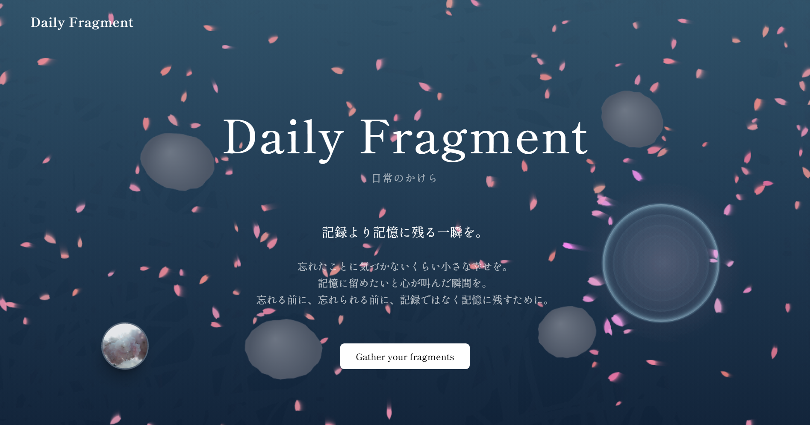
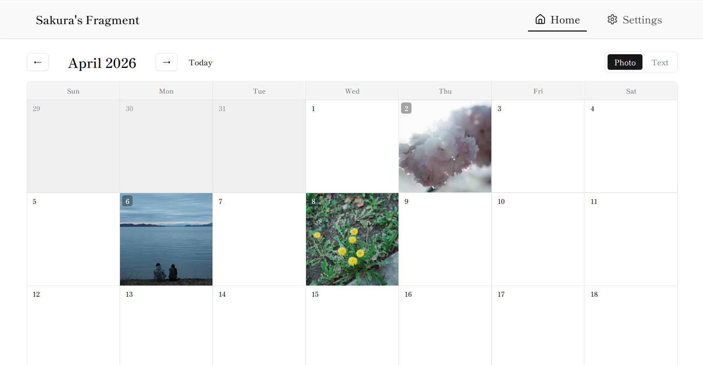
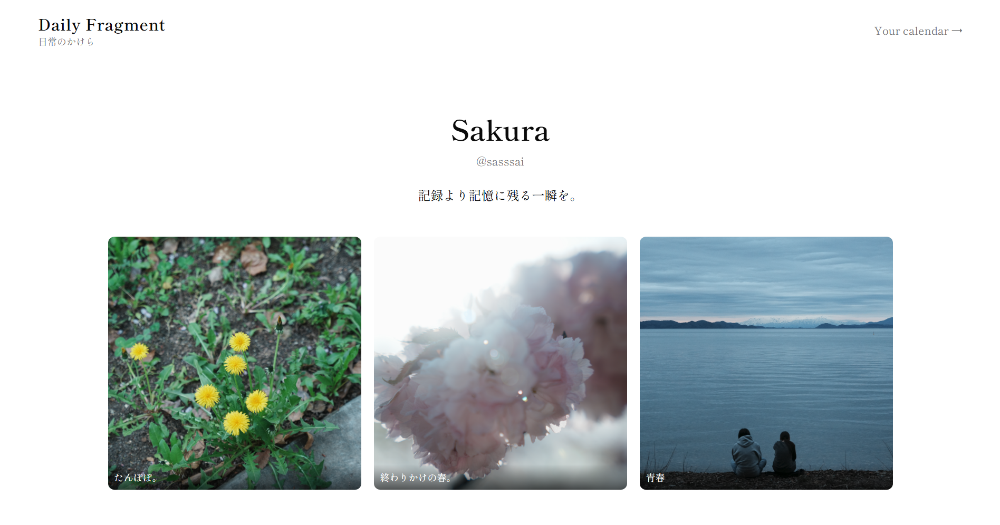

# Daily Fragment — 日常のかけら

日々の小さな幸せを、写真とテキストでひっそり記録する Web アプリ。



🌐 **Live demo**: https://main.d3t36zroe5q2tz.amplifyapp.com  
🔧 **Repository**: https://github.com/sasssai/today-small-hanami

---

## コンセプト

「記録より記憶に残る一瞬を。」をテーマに、**派手な機能ではなく日常の繊細な瞬間を残す**ことを目指したSNS。
SNSの喧騒から距離を置き、自分のペースで小さな美しさを集めていける場所。

世界観の軸：

- **明朝体（Shippori Mincho）**：静かな空気感を文字に宿す
- **桜のパーティクル**：時間とともに散っていく、儚さ
- **Floating Pins**：他のユーザーがピン留めした瞬間が、花びらのように画面に流れてくる。
- **公開ポートフォリオ `/{handle}`**：自分の"お気に入りの今日"を共有する。お気に入りを集めてるだけだと孤独感が生まれるので、自分以外の誰かも"今日"を生きていて"お気に入りの今日"があったという実感を得られるページに。

「投稿する → 反応を得る」ループではなく、**「日々を残す → 振り返る → そっと開く」**の流れを大切にしている。

---

## 主な機能

| 機能 | 概要 |
|------|------|
| カレンダー型ホーム | 月単位で日々の投稿をビジュアル化。写真／テキストの2タブ切替 |
| 投稿モーダル | カレンダーの日付クリックで開く。写真＋ひとことキャプション |
| Photo Viewer | 投稿写真の拡大表示。Pin / Edit / Delete を一画面で完結 |
| ピン留め（最大6個） | お気に入りの瞬間を公開ポートフォリオに固定 |
| プロフィール編集 | Username / Display Name / Bio をいつでも更新 |
| 公開ポートフォリオ `/{handle}` | ログイン不要の閲覧専用ページ。ピン留めした瞬間だけが並ぶ |
| 桜 Canvas 背景 | 全画面に降る桜のパーティクル。WebGL ではなく素の Canvas API |
| Floating Pins | 他ユーザーの公開ピンが花びらのように流れる、ゆるやかな繋がり |
| メール認証 | Supabase Auth + Resend SMTP で確認メール送信 |
| 完全レスポンシブ | スマホ／タブレット／PC すべての画面サイズに対応 |

### 画面プレビュー

**ホーム（カレンダー）**



**公開ポートフォリオ `/{handle}`**



---

## 技術スタック & 選定理由

### Frontend

| 技術 | 採用理由 |
|------|---------|
| **Next.js 16 (App Router)** | SSR で初回描画が速い。ポートフォリオサイトとして開いた瞬間に世界観が伝わる速度が必要だった。App Router のファイルベースルーティングで認証付き／公開ページの境界が明確に書ける |
| **shadcn/ui + Radix UI** | アクセシビリティが標準で組み込まれている。npm の隠蔽パッケージではなくソースコードがプロジェクトに入る形式なので、必要に応じて挙動を理解しながら拡張できる |
| **Shippori Mincho (Google Fonts)** | 明朝体で和の静寂感を出す。サンセリフでは出せない "間" を文字レベルで作る |

### Backend / Infrastructure

| 技術 | 採用理由 |
|------|---------|
| **Supabase** | Postgres + Auth + Storage + Realtime を一つで賄える。**Row Level Security (RLS)** でアクセス制御を DB 層に閉じ込められるので、フロント側のロジックがシンプルになる |
| **Resend** | 開発者向けに作られたメール API。`smtp.resend.com` 経由で Supabase Auth の確認メール送信に使用 |
| **AWS Amplify** | Next.js の SSR に完全対応したホスティング。GitHub 連携による自動デプロイ、環境変数管理、ビルドログ閲覧が一画面に揃っている |
| **GitHub Actions** | PR ごとの `npm run check` ＋ `npm run build` の自動チェック、main へのマージで Supabase migration と Edge Functions を本番反映 |

### グラフィックス（独自実装・適材適所）

| 技術 | 採用箇所 | 採用理由 |
|------|----------|---------|
| **HTML Canvas API（生）** | 桜パーティクル（最大220個） | `requestAnimationFrame` ループで毎フレームのパーティクル更新と描画を直接記述。p5.js などのラッパーを使わず Canvas API を直接扱うことで、内部の挙動を理解しながら 60fps を維持。多数の点をピクセル単位で動かす用途は Canvas が最適 |
| **CSS Animation + DOM** | Floating Pins（公開ピンの花びら表示） | 各 pin に個別の `duration` / `delay` / 出現位置を JS で割り当て、Next.js の `<Link>` + `` を CSS アニメーションで画面外から流す。**少数（10個前後）のクリック可能な画像要素**には Canvas より DOM の方が適切（リンク遷移・アクセシビリティが標準で動く） |

→ 同じ "画面に流れる花びら" の表現でも、**特性で技術を使い分けている**点を意識した。

---

## アーキテクチャ概要

```
┌─────────────────────────────────────────────────────┐
│                     ユーザー                       　│
└───────────────┬─────────────────────────────────────┘
                │
                ▼
┌─────────────────────────────────────────────────────┐
│        AWS Amplify (Next.js SSR ホスティング)        │
│  ┌────────────┬────────────────────────────────┐    │
│  │ Public     │ Protected                      │    │
│  │ /          │ /protected/home (Calendar)     │    │
│  │ /{handle}  │ /protected/settings            │    │
│  │ /auth/*    │ /onboarding                    │    │
│  └────────────┴────────────────────────────────┘    │
│                                                     │
│  Sakura Canvas / Floating Pins (Canvas API)         │
└───────────────┬─────────────────────────────────────┘
                │
                ▼
┌─────────────────────────────────────────────────────┐
│                    Supabase                         │
│  ┌──────────┬──────────┬──────────┬─────────────┐   │
│  │ Auth     │ Postgres │ Storage  │ RLS Policy  │   │
│  │ (Email)  │ profiles │ post-    │ user-scoped │   │
│  │          │ posts    │ images   │ access      │   │
│  └──────────┴──────────┴──────────┴─────────────┘   │
└───────────────┬─────────────────────────────────────┘
                │ (確認メール)
                ▼
        ┌──────────────┐
        │    Resend    │
        │　(SMTP送信)　 │
        └──────────────┘
```

### ユーザーフロー

```
ランディング (/)
    ↓
サインアップ (/auth/sign-up)
    ↓
確認メール (Resend → Gmail)
    ↓
オンボーディング (/onboarding) ─ ハンドル設定
    ↓
カレンダー (/protected/home) ─ 投稿・閲覧の中心
    ↓ ↑
公開プロフィール (/{handle}) ─ 他者から見える時間軸
```

---

## デザインの工夫

- **明朝体オンリー**：UI 全体を Shippori Mincho に統一して、和の静けさを担保
- **配色**：白基調＋黒文字＋桜色アクセント。視覚的ノイズを最小化
- **桜パーティクルのチューニング**：散る速度・サイズ・出現位置を試行錯誤して、邪魔にならず気配だけ残るバランスに
- **Floating Pins の挙動**：他者のピン留めが流れるように画面外から入り、画面外に消える（CSS アニメーション、画像クリックでオーナーの公開ページに遷移可能）。**「誰かがこの瞬間を大切にしてる」を間接的に伝える設計**
- **モバイルファースト**：スマホでの閲覧体験を主軸に設計し、PC は余白を活かした横長レイアウト
- **削除ボタンの配置**：当初ホバー表示だったがタッチデバイスで使えないことに気づき、PhotoViewer に常時表示の Delete ボタンを追加（このリポジトリの PR 履歴に残っている）

---

## クレジット

- **scarlet7-template** (by NOP / shogo, private repository): 初期テンプレート（Next.js + Supabase + Amplify の足場）を提供いただきました。

  
- **本作品の担当範囲**:
  - 作品コンセプト・世界観・命名の設計
  - すべての画面・機能の実装（onboarding / calendar / post / photo viewer / pin / public profile / settings）
  - 桜 Canvas / Floating Pins のグラフィック実装
  - UI/UX 設計とレスポンシブ対応
  - デプロイ作業（Supabase 本番プロジェクト構築、AWS Amplify 設定、Resend 連携）

---

## 📄 License

MIT License — scarlet7-template のライセンスを継承

---

